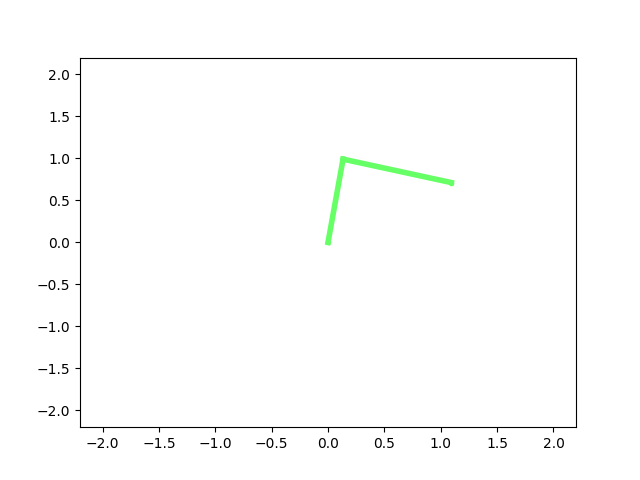

# Double_Pendulum_Simulation
A simulation of a double pendulum in python. the equations of motion were derived from scratch by forming the Lagrangian and applying Euler-Lagrange.  The equations were then organised into MCG format to solve for acceleration and Euler-Cromer integration was used to calculate angular velocities and joint angles at each step.

## Demo

